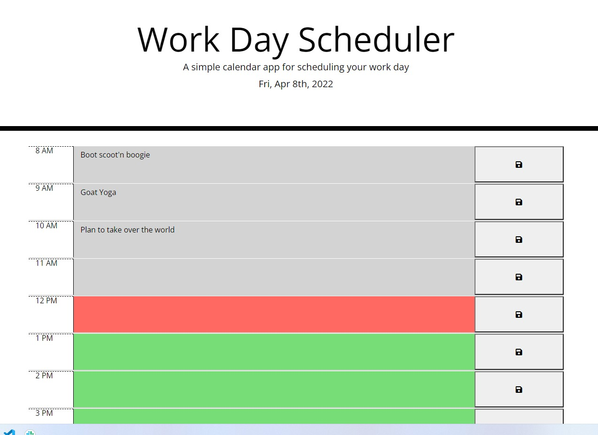

#Work Day Scheduler
This project is a work day calendar planner which displays the current date at the top of the page and then dislays the hours of a usual workday in a column. In each hour block you can type in a task and save it to local storage. The calendar tracks the current hour greying out the hours that have past, highlighting the current hour in red, and highlighting the upcoming hours in green.

Here is what it looks like.

Repo: https://github.com/ernypoo92/Work-Day-Schedlr

Deployed project: https://ernypoo92.github.io/Work-Day-Schedlr/# Work Day Scheduler Starter Code
